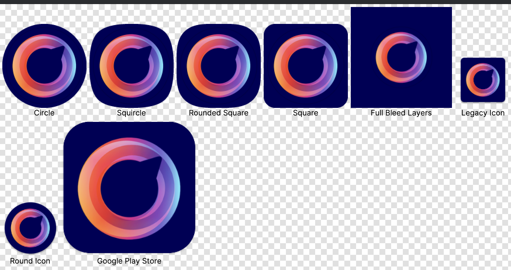

<div align="center">

# 🚀 Ino Icon Maker

**Generate iOS & Android app icons from a single image**

[](https://www.npmjs.com/package/ino-icon-maker)
[](https://www.npmjs.com/package/ino-icon-maker)
[](https://opensource.org/licenses/MIT)
[](https://nodejs.org/)

[📦 npm](https://www.npmjs.com/package/ino-icon-maker) • [💻 GitHub](https://github.com/narek589/ino-icon-maker) • [📚 Docs](https://github.com/narek589/ino-icon-maker/tree/main/docs) • [🐛 Issues](https://github.com/narek589/ino-icon-maker/issues)

**One command. All sizes. Both platforms.**

</div>

---

## 📸 What You Get

<table>
<tr>
<td width="50%" valign="top">

### 🍎 iOS

<div align="center">

**19 icons** • `AppIcon.appiconset/`

<br/>


</div>

<br/>

| Feature      | Details             |
| ------------ | ------------------- |
| 📱 Devices   | iPhone, iPad, Watch |
| 🏪 App Store | 1024×1024 icon      |
| 📄 Metadata  | Contents.json       |

</td>
<td width="50%" valign="top">

### 🤖 Android

<div align="center">

**33 icons** • `mipmap-*/` folders

<br/>



</div>

<br/>

| Feature      | Details                 |
| ------------ | ----------------------- |
| 🎨 Adaptive  | Foreground + Background |
| ⭕ Legacy    | Round & Square icons    |
| 📐 Densities | ldpi to xxxhdpi         |

</td>
</tr>
</table>

---

## ⚡ Quick Start

```bash
# NPX (no install needed)
npx ino-icon-maker generate -fg icon.png

# Or install globally
npm install -g ino-icon-maker
ino-icon generate -fg icon.png

# With custom background
ino-icon generate -fg icon.png -bg "#FF5722"
```

**That's it!** Generates icons for both iOS and Android in `./icons/` directory.

---

## 📋 CLI Options

### Generate Command

```bash
ino-icon generate [options]
```

**Simple unified workflow**: Use `-fg` for your icon, optionally add `-bg` for background layer.

| Option                   | Description                                         | Default   |
| ------------------------ | --------------------------------------------------- | --------- |
| `-fg <path>`             | **Foreground/main icon** (required)                 | -         |
| `-bg <path>`             | Background layer (image or hex color `#FF5722`)     | `#111111` |
| `-m <path>`              | Monochrome layer (Android adaptive icons)           | -         |
| `-o <dir>`               | Output directory                                    | `icons`   |
| `-p <platform>`          | Target platform: `ios`, `android`, `all`            | `all`     |
| `-z`                     | Create ZIP archive                                  | `false`   |
| `-f`                     | Force overwrite existing files                      | `false`   |
| `--install`              | Auto-install to React Native/Flutter project        | `false`   |
| `--fg-scale <n>`         | Scale foreground content (e.g., `2.0` = zoom in 2x) | `1.0`     |
| `--fg-scale-ios <n>`     | iOS-specific foreground content scale               | `1.0`     |
| `--fg-scale-android <n>` | Android-specific foreground content scale           | `1.0`     |
| `--exclude <sizes>`      | Exclude sizes (e.g., `ldpi,20x20@2x`)               | -         |
| `--custom-config <path>` | Path to JSON file with size customization           | -         |

**Note**: `-fg` is required. `-bg` is optional and defaults to dark background (`#111111`)

### Other Commands

```bash
# Show platform information
ino-icon info

# List supported platforms
ino-icon platforms

# Start HTTP API server
ino-icon serve
```

### Usage Examples

```bash
# Generate for all platforms (iOS + Android)
ino-icon generate -fg icon.png

# Generate for iOS only
ino-icon generate -fg icon.png -p ios

# With custom background color
ino-icon generate -fg icon.png -bg "#FF5722"

# With background image
ino-icon generate -fg foreground.png -bg background.png

# With all three layers (foreground, background, monochrome)
ino-icon generate -fg foreground.png -bg background.png -m monochrome.png

# Create ZIP archive
ino-icon generate -fg icon.png -z

# Zoom in foreground content 2x (for images with too much padding)
ino-icon generate -fg icon.png --fg-scale 2.0

# Auto-install to React Native/Flutter project
ino-icon generate -fg icon.png --install

# Exclude specific sizes
ino-icon generate -fg icon.png --exclude "ldpi,20x20@2x"

# Custom config file
ino-icon generate -fg icon.png --custom-config config.json
```

---

## 🔧 Framework Setup

### React Native

```bash
# Auto-install to project
cd my-react-native-app
ino-icon generate -fg assets/icon.png --install
```

**Or add to package.json:**

```json
{
	"scripts": {
		"icons": "ino-icon generate -fg assets/icon.png --install"
	}
}
```

**Manual installation:**

```bash
ino-icon generate -fg icon.png -o temp
cp -r temp/AppIcon.appiconset ios/YourApp/Images.xcassets/
cp -r temp/android-icons/* android/app/src/main/res/
rm -rf temp
```

### Flutter

```bash
# Auto-install to project
cd my-flutter-app
ino-icon generate -fg assets/icon.png --install
```

**Manual installation:**

```bash
ino-icon generate -fg icon.png -o temp
cp -r temp/AppIcon.appiconset ios/Runner/Assets.xcassets/
cp -r temp/android-icons/* android/app/src/main/res/
rm -rf temp
```

### Node.js / Programmatic

```javascript
import { quickGenerate } from "ino-icon-maker";

// Simple usage - icon with default dark background
await quickGenerate({
	foreground: "./icon.png",
	output: "./output",
	zip: true,
});

// With custom background color
await quickGenerate({
	foreground: "./icon.png",
	background: "#FF5722",
	output: "./output",
});

// With foreground content scaling (zoom in/out)
await quickGenerate({
	foreground: "./icon.png",
	output: "./output",
	fgScale: 2.0, // Zoom in 2x (for images with too much padding)
});

// Platform-specific foreground scaling
await quickGenerate({
	foreground: "./icon.png",
	output: "./output",
	fgScaleIos: 1.5,
	fgScaleAndroid: 2.0,
});

// With size exclusions
await quickGenerate({
	foreground: "./icon.png",
	output: "./output",
	customSizes: {
		android: { excludeSizes: ["ldpi", "monochrome"] },
	},
});
```

### HTTP API / Server

```bash
# Start server
ino-icon serve -p 3000

# Generate icons
curl -F "file=@icon.png" http://localhost:3000/generate -o icons.zip

# With foreground content scaling
curl -F "file=@icon.png" \
  -F "fgScale=2.0" \
  http://localhost:3000/generate -o icons.zip

# With size exclusions
curl -F "file=@icon.png" \
  -F 'customSizes={"android":{"excludeSizes":["ldpi"]}}' \
  http://localhost:3000/generate -o icons.zip
```

### CI/CD (GitHub Actions)

```yaml
name: Generate Icons
on: [push]
jobs:
  icons:
    runs-on: ubuntu-latest
    steps:
      - uses: actions/checkout@v3
      - uses: actions/setup-node@v3
      - run: npx ino-icon-maker generate -fg icon.png --install
      - run: git add . && git commit -m "Update icons" && git push
```

---

## 📊 Supported Sizes

### iOS Icons

| Size      | Scale    | Pixels  | Usage        |
| --------- | -------- | ------- | ------------ |
| 20×20     | @2x, @3x | 40, 60  | Notification |
| 29×29     | @2x, @3x | 58, 87  | Settings     |
| 40×40     | @2x, @3x | 80, 120 | Spotlight    |
| 60×60     | @2x, @3x | 120,180 | iPhone App   |
| 76×76     | @2x      | 152     | iPad App     |
| 83.5×83.5 | @2x      | 167     | iPad Pro     |
| 1024×1024 | @1x      | 1024    | App Store    |

**Total: 19 icons**

### Android Icons

| Density   | Size    | Usage                      |
| --------- | ------- | -------------------------- |
| ldpi      | 36×36   | Low density (120 dpi)      |
| mdpi      | 48×48   | Medium density (160 dpi)   |
| hdpi      | 72×72   | High density (240 dpi)     |
| xhdpi     | 96×96   | Extra-high (320 dpi)       |
| xxhdpi    | 144×144 | Extra-extra-high (480 dpi) |
| xxxhdpi   | 192×192 | Extra³-high (640 dpi)      |
| playstore | 512×512 | Google Play Store          |

**+ Adaptive icons (foreground, background, monochrome)**  
**Total: 33 icons**

---

## ⚙️ Custom Sizes

### Scale Foreground Content

Control how large the foreground appears inside the icon (useful for Figma exports with padding):

```bash
# Zoom in foreground 2x (for images with too much padding from Figma)
ino-icon generate -fg icon.png --fg-scale 2.0

# Zoom out foreground (add more padding)
ino-icon generate -fg icon.png --fg-scale 0.5

# Platform-specific scaling
ino-icon generate -fg icon.png --fg-scale-ios 1.5 --fg-scale-android 2.0
```

**Note:** This scales the foreground content size, not the output file dimensions. File sizes remain correct (e.g., iOS 1024×1024, Android 48×48).

### Exclude Sizes

```bash
# Android: Skip low-density
ino-icon generate -fg icon.png --exclude "ldpi"

# Android: Skip monochrome
ino-icon generate -fg icon.png --exclude "monochrome"

# iOS: Skip small sizes
ino-icon generate -fg icon.png --exclude "20x20,29x29"
```

### Custom Config File

Create a config file for advanced customization:

**custom-sizes.json:**

```json
{
	"ios": {
		"excludeSizes": ["20x20@2x"]
	},
	"android": {
		"excludeSizes": ["ldpi", "monochrome"],
		"addSizes": [
			{
				"density": "xxxxhdpi",
				"size": 256,
				"folder": "mipmap-xxxxhdpi",
				"filename": "ic_launcher.png"
			}
		]
	}
}
```

```bash
ino-icon generate -fg icon.png --custom-config custom-sizes.json
```

**[📖 Full Custom Sizes Documentation](./docs/guides/CUSTOM_SIZES.md)**

---

## 📚 More Resources

| Resource                                                    | Description               |
| ----------------------------------------------------------- | ------------------------- |
| [Custom Sizes Guide](./docs/guides/CUSTOM_SIZES.md)         | Scale, add, exclude sizes |
| [Adaptive Icons Guide](./docs/guides/ADAPTIVE_ICONS.md)     | Android adaptive icons    |
| [Icon Padding Config](./docs/guides/ICON_PADDING_CONFIG.md) | Configure zoom/padding    |
| [Complete Examples](./docs/examples/COMPLETE_EXAMPLES.md)   | All usage examples        |
| [Architecture Docs](./docs/architecture/ARCHITECTURE.md)    | Technical design          |
| [Changelog](./docs/CHANGELOG.md)                            | Version history           |

**[📍 Full Documentation](./docs/DOCUMENTATION_MAP.md)**

---

## 🤝 Contributing

Contributions welcome! See [CONTRIBUTING.md](./docs/CONTRIBUTING.md)

```bash
git clone https://github.com/narek589/ino-icon-maker.git
cd ino-icon-maker
npm install
npm run dev
```

---

<div align="center">

**Built with [Sharp](https://sharp.pixelplumbing.com/), [Archiver](https://www.archiverjs.com/), [Express](https://expressjs.com/)**

**[⭐ Star this project](https://github.com/narek589/ino-icon-maker)** • [🐛 Issues](https://github.com/narek589/ino-icon-maker/issues) • [💬 Discussions](https://github.com/narek589/ino-icon-maker/discussions)

---

## 🙏 Acknowledgments

Special thanks to [**inorain**](https://inorain.com/) for inspiration and support in building this tool.

</div>
